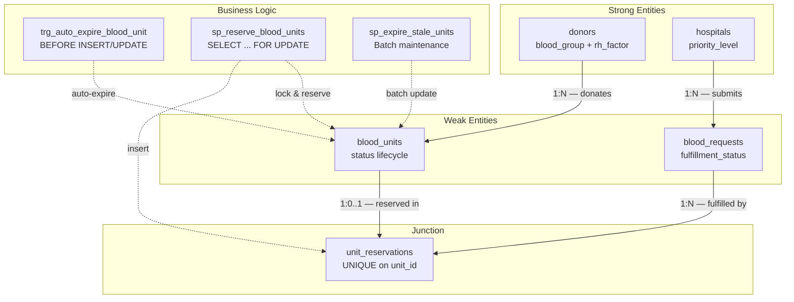
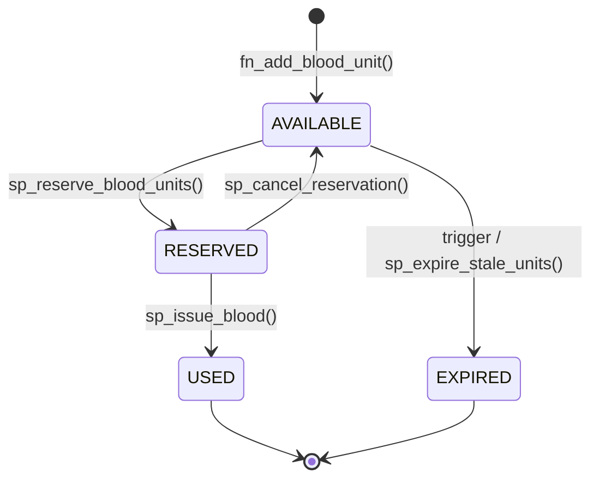

# Blood Bank & Emergency Donor-Matching System

## Database Architecture Documentation

---

### Table of Contents

1. [Project Overview](#project-overview)
2. [Architecture Diagram](#architecture-diagram)
3. [Normalization — 3NF / BCNF](#normalization--3nf--bcnf)
4. [Schema Objects](#schema-objects)
5. [Triggers & Automatic Expiry](#triggers--automatic-expiry)
6. [Stored Procedures & Functions](#stored-procedures--functions)
7. [Transaction Management & Concurrency Control](#transaction-management--concurrency-control)
8. [Indexing Strategy](#indexing-strategy)
9. [Race-Condition Prevention](#race-condition-prevention)
10. [File Inventory](#file-inventory)
11. [Deployment Guide](#deployment-guide)
12. [Usage Examples](#usage-examples)

---

## Project Overview

A production-grade PostgreSQL relational database for managing blood bank inventory, donor registration, hospital blood requests, and emergency donor matching. The system is designed to handle **concurrent** hospital requests for the same blood type without double-booking units, using **database-level locking** and **transactional integrity**.

### Core Entities

| Entity | Table | Type | Purpose |
|--------|-------|------|---------|
| Donors | `donors` | Strong | Demographics, blood type (canonical source), contact info |
| Blood Units | `blood_units` | Weak | Individual collected units with lifecycle tracking |
| Hospitals | `hospitals` | Strong | Registered hospitals with priority tiers |
| Blood Requests | `blood_requests` | Weak | Hospital requests for specific blood types |
| Reservations | `unit_reservations` | Junction | Maps units to requests (anti-double-booking guard) |

---

## Architecture Diagram



### Data Flow: Blood Unit Lifecycle



---

## Normalization — 3NF / BCNF

### Why This Matters

Blood bank data integrity is **life-critical**. A redundant or inconsistent blood type record could result in a mismatched transfusion. Strict normalization eliminates these risks.

### 1NF (First Normal Form)
- ✅ All columns are atomic (no multi-valued attributes)
- ✅ Every table has a primary key
- ✅ No repeating groups

### 2NF (Second Normal Form)
- ✅ All non-key attributes are fully functionally dependent on the entire primary key
- ✅ All tables use single-column surrogate keys (SERIAL), so partial dependencies are impossible

### 3NF (Third Normal Form)
- ✅ No transitive dependencies exist
- ✅ **Critical design decision**: Blood type (`blood_group` + `rh_factor`) is stored **only** on the `donors` table. The `blood_units` table references the donor via FK — blood type is derived through a JOIN, never duplicated.
  - This eliminates the transitive dependency: `blood_units.unit_id → blood_units.donor_id → donors.blood_group`
  - If blood type were stored on both tables, an update to a donor's blood type (e.g., data correction) would require updating every related blood unit — a classic update anomaly.

### BCNF (Boyce-Codd Normal Form)
- ✅ Every determinant is a candidate key
- ✅ No non-trivial functional dependencies where the determinant is not a superkey

---

## Schema Objects

### Custom ENUM Types

| Type | Values | Purpose |
|------|--------|---------|
| `blood_group_enum` | A, B, AB, O | ABO classification |
| `rh_factor_enum` | POSITIVE, NEGATIVE | Rhesus factor |
| `unit_status_enum` | AVAILABLE, RESERVED, USED, EXPIRED | Unit lifecycle |
| `priority_level_enum` | NORMAL, HIGH, CRITICAL | Hospital priority tier |
| `urgency_enum` | ROUTINE, URGENT, EMERGENCY | Request urgency |
| `fulfillment_status_enum` | PENDING, PARTIAL, FULFILLED, CANCELLED | Request progress |

### CHECK Constraints

| Table | Constraint | Rule |
|-------|-----------|------|
| `donors` | `chk_donor_min_age` | `date_of_birth ≤ CURRENT_DATE - 18 years` |
| `blood_units` | `chk_expiration_after_collection` | `expiration_date > collection_date` |
| `blood_units` | `chk_positive_volume` | `volume_ml > 0` |
| `blood_requests` | `chk_quantity_positive` | `quantity ≥ 1` |
| `blood_requests` | `chk_fulfilled_after_requested` | `fulfilled_at IS NULL OR fulfilled_at ≥ requested_at` |

### Foreign Keys & Cascading Rules

| FK | ON UPDATE | ON DELETE | Rationale |
|----|-----------|-----------|-----------|
| `blood_units.donor_id → donors` | CASCADE | CASCADE | Purging a donor removes their units |
| `blood_requests.hospital_id → hospitals` | CASCADE | RESTRICT | Cannot delete a hospital with active requests |
| `unit_reservations.unit_id → blood_units` | CASCADE | RESTRICT | Cannot delete a reserved unit |
| `unit_reservations.request_id → blood_requests` | CASCADE | CASCADE | Cancelling a request removes reservations |

---

## Triggers & Automatic Expiry

### Row-Level Trigger: `trg_auto_expire_blood_unit`

- **Timing**: `BEFORE INSERT OR UPDATE` on `blood_units`
- **Scope**: `FOR EACH ROW`
- **Logic**: If `status = 'AVAILABLE'` AND `expiration_date < CURRENT_DATE` → set `status = 'EXPIRED'`
- **Why BEFORE?** Allows mutation of `NEW` before the row is written to disk

### Batch Procedure: `sp_expire_stale_units()`

- **Purpose**: Sweeps the entire `blood_units` table and expires all stale AVAILABLE units
- **Usage**: `CALL sp_expire_stale_units();`
- **Scheduling**: Run daily via `pg_cron` or application scheduler

### Two-Layer Defence

The trigger catches units on contact (INSERT/UPDATE), while the batch procedure catches units that haven't been touched since they expired. Together, they guarantee no stale AVAILABLE unit persists.

---

## Stored Procedures & Functions

### Functions (return values, run inside caller's transaction)

| Function | Input | Returns | Purpose |
|----------|-------|---------|---------|
| `fn_register_donor()` | Donor details | `INT` (donor_id) | Register new donor, validate uniqueness |
| `fn_add_blood_unit()` | donor_id, collection_date | `INT` (unit_id) | Record blood collection, auto-calc expiry |
| `fn_get_available_inventory()` | Optional blood type filter | `TABLE` | Real-time inventory summary |

### Procedures (manage own transactions with COMMIT/ROLLBACK)

| Procedure | Input | Purpose |
|-----------|-------|---------|
| `sp_reserve_blood_units()` | request_id, allow_partial | **Critical path** — lock + reserve units |
| `sp_cancel_reservation()` | request_id | Release units, cancel request |
| `sp_issue_blood()` | request_id | Mark reserved units as USED |
| `sp_daily_expiry_maintenance()` | — | Wrapper for batch expiry |

---

## Transaction Management & Concurrency Control

### The Problem: Double-Booking Race Condition

When two hospitals simultaneously request O+ blood and only 3 units remain:

```
Hospital A: "I need 2 units of O+"    Hospital B: "I need 2 units of O+"
    ↓ (reads 3 available)                  ↓ (reads 3 available)
    ↓ (reserves units 1,2)                 ↓ (reserves units 1,2)  ← CONFLICT!
```

Without proper locking, both transactions see 3 available units and both try to reserve the same ones.

### The Solution: SELECT ... FOR UPDATE

```sql
SELECT bu.unit_id
FROM   blood_units bu
INNER JOIN donors d ON d.donor_id = bu.donor_id
WHERE  d.blood_group = 'O' AND d.rh_factor = 'POSITIVE'
  AND  bu.status = 'AVAILABLE'
  AND  bu.expiration_date >= CURRENT_DATE
ORDER BY bu.expiration_date ASC
FOR UPDATE OF bu     -- ← Acquires exclusive row-level locks
LIMIT 2;
```

### How FOR UPDATE Prevents Double-Booking

In PostgreSQL's default **READ COMMITTED** isolation level:

| Step | Transaction A | Transaction B |
|------|--------------|--------------|
| 1 | `SELECT ... FOR UPDATE` → locks units 1,2,3 | |
| 2 | Reserves units 1,2. Sets status → RESERVED | |
| 3 | | `SELECT ... FOR UPDATE` → **BLOCKS** on units 1,2 |
| 4 | **COMMIT** → releases locks | |
| 5 | | Lock acquired. **Re-checks WHERE clause** on latest data |
| 6 | | Units 1,2 status = RESERVED → **excluded** |
| 7 | | Only unit 3 matches → reserves unit 3 |
| 8 | | Needed 2, got 1 → **ROLLBACK** (insufficient) |

### The UNIQUE INDEX Safety Net

Even if a bug bypassed the procedure logic, the unique index on `unit_reservations(unit_id)` provides a hard database-level guarantee:

```sql
CREATE UNIQUE INDEX uq_reservation_unit ON unit_reservations (unit_id);
```

Any attempt to reserve an already-reserved unit will fail with a `unique_violation` error.

### Transaction Control in Procedures

```
sp_reserve_blood_units(request_id, allow_partial)
│
├── BEGIN (implicit)
│   ├── Validate request
│   ├── SELECT ... FOR UPDATE (lock rows)
│   ├── UPDATE blood_units SET status = 'RESERVED'
│   ├── INSERT INTO unit_reservations
│   │
│   ├── IF sufficient units:
│   │   └── COMMIT ✓
│   │
│   └── IF insufficient units:
│       ├── ROLLBACK ✗ (undoes all changes, releases locks)
│       └── RAISE EXCEPTION
```

---

## Indexing Strategy

### Performance Indexes

| Index | Table | Columns | Optimises |
|-------|-------|---------|-----------|
| `idx_donors_blood_type` | donors | (blood_group, rh_factor) | Donor matching queries |
| `idx_blood_units_status` | blood_units | (status) | Filter by unit status |
| `idx_blood_units_expiration` | blood_units | (expiration_date) | Expiry checks |
| `idx_blood_units_donor` | blood_units | (donor_id) | JOIN optimization |
| `idx_requests_blood_type` | blood_requests | (requested_blood_group, requested_rh_factor) | Match requests to inventory |
| `idx_requests_fulfillment` | blood_requests | (fulfillment_status) | Dashboard filters |
| `idx_requests_urgency` | blood_requests | (urgency) | Priority triage |
| `idx_reservations_request` | unit_reservations | (request_id) | Count allocated units |

### Integrity Index

| Index | Table | Columns | Purpose |
|-------|-------|---------|---------|
| `uq_reservation_unit` | unit_reservations | (unit_id) UNIQUE | Anti-double-booking guard |

---

## Race-Condition Prevention

### Layer 1: Row-Level Locking (`SELECT ... FOR UPDATE`)
Serialises access to candidate blood units. Competing transactions **block** until the lock is released.

### Layer 2: Read-Committed Re-evaluation
After a blocked transaction acquires the lock, PostgreSQL re-evaluates the WHERE clause on the latest committed data. Rows that no longer match (status changed from AVAILABLE to RESERVED) are **excluded**.

### Layer 3: UNIQUE Index on `unit_reservations(unit_id)`
Even if application logic has a bug, the database will reject any attempt to reserve an already-reserved unit with a `unique_violation` error.

### Layer 4: ENUM Constraints
Status values are restricted by the `unit_status_enum` type. Invalid status transitions (e.g., setting status to 'READY') are rejected at the type level.

### Layer 5: CHECK Constraints
Domain rules (minimum age, positive volume, expiration after collection) are enforced at the row level, regardless of how data enters the system.

---

## File Inventory

| File | Phase | Description |
|------|-------|-------------|
| `schema.sql` | Day 1 | Complete DDL: ENUMs, tables, FKs, CHECKs, indexes |
| `triggers.sql` | Day 1 | Auto-expiration trigger + batch maintenance procedure |
| `procedures.sql` | Day 2 | Stored procedures for all business operations |
| `queries.sql` | Day 2 | 27+ advanced analytical queries and views |
| `seed.sql` | Day 2 | Realistic sample data (40 donors, 150 units, etc.) |
| `README_DATABASE.md` | Day 2 | This documentation file |

---

## Deployment Guide

### Prerequisites
- PostgreSQL 14+ (for procedure transaction control)
- A database created for the project

### Installation Order

```bash
# 1. Create the database
createdb blood_bank_db

# 2. Install schema (ENUMs, tables, indexes, constraints)
psql -U your_user -d blood_bank_db -f schema.sql

# 3. Install triggers (auto-expiry logic)
psql -U your_user -d blood_bank_db -f triggers.sql

# 4. Install stored procedures and functions
psql -U your_user -d blood_bank_db -f procedures.sql

# 5. (Optional) Load sample data
psql -U your_user -d blood_bank_db -f seed.sql

# 6. (Optional) Run analytical queries
psql -U your_user -d blood_bank_db -f queries.sql
```

### Schedule Daily Maintenance

```sql
-- Using pg_cron (requires extension)
SELECT cron.schedule('daily-blood-expiry', '0 0 * * *', 'CALL sp_daily_expiry_maintenance()');
```

---

## Usage Examples

### Register a Donor
```sql
SELECT fn_register_donor(
    'Aarav', 'Sharma', '1990-03-15',
    'O', 'POSITIVE',
    '+91-9876543210', 'aarav@email.com', '12 MG Road, Bengaluru'
);
-- Returns: 1 (donor_id)
```

### Record a Blood Collection
```sql
SELECT fn_add_blood_unit(1);
-- Returns: unit_id. Expiry auto-calculated as TODAY + 42 days.
```

### Reserve Blood for a Hospital Request
```sql
-- All-or-nothing (default)
CALL sp_reserve_blood_units(42);

-- Allow partial fulfillment
CALL sp_reserve_blood_units(42, TRUE);
```

### Issue Blood to Hospital
```sql
CALL sp_issue_blood(42);
```

### Cancel a Reservation
```sql
CALL sp_cancel_reservation(42);
```

### Check Available Inventory
```sql
-- All blood types
SELECT * FROM fn_get_available_inventory();

-- Specific type
SELECT * FROM fn_get_available_inventory('O', 'POSITIVE');
```
